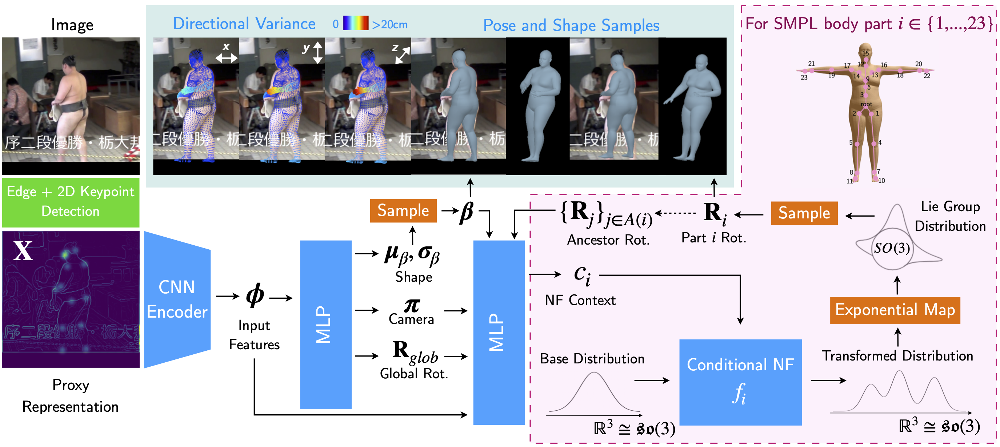

# HuManiFlow

Code repository for the paper:  
**HuManiFlow: Ancestor-Conditioned Normalising Flows on SO(3) Manifolds for Human Pose and Shape Distribution Estimation**  
[Akash Sengupta](https://akashsengupta1997.github.io/), [Ignas Budvytis](http://mi.eng.cam.ac.uk/~ib255/), [Roberto Cipolla](https://mi.eng.cam.ac.uk/~cipolla/)  
CVPR 2023  
[[paper+supplementary](https://arxiv.org/abs/2305.06968)]

This paper presents a probabilistic approach to 3D human shape and pose estimation, which aims to improve sample-input consistency and sample diversity over contemporary methods.




This repository contains inference, training and evaluation code. A few weaknesses of this approach, and future research directions, are listed below.
If you find this code useful in your research, please cite the following publication:
```
@InProceedings{sengupta2023humaniflow,
               author = {Sengupta, Akash and Budvytis, Ignas and Cipolla, Roberto},
               title = {{HuManiFlow: Ancestor-Conditioned Normalising Flows on SO(3) Manifolds for Human Pose and Shape Distribution Estimation}},
               booktitle = {CVPR},
               month = {June},
               year = {2023}                         
}
```

## Installation

### Requirements
- Linux or macOS
- Python ≥ 3.7

### Instructions
First clone the repo:
```
git clone https://github.com/akashsengupta1997/HuManiFlow.git
```
We recommend using a virtual environment to install relevant dependencies:
```
python3.8 -m venv HuManiFlow_env
source HuManiFlow_env/bin/activate
```
Install torch and torchvision (the code has been tested with v1.9.0 of torch), as well as other dependencies: 
```
pip install torch==1.9.0 torchvision==0.10.0
pip install -r requirements.txt
``` 
Finally, install [pytorch3d](https://github.com/facebookresearch/pytorch3d/blob/v0.7.1/INSTALL.md), 
which we use for data generation during training and visualisation during inference. 
To do so, you will need to first install the CUB library following the instructions [here](https://github.com/facebookresearch/pytorch3d/blob/v0.7.1/INSTALL.md). 
Then you may install pytorch3d - note that the code has been tested with v0.7.1 of pytorch3d, and we recommend installing this version using: 
```
pip install "git+https://github.com/facebookresearch/pytorch3d.git@v0.7.1"
```

### Model files
You will need to download SMPL model files from [here](https://smpl.is.tue.mpg.de/). The neutral model is required for training and running the demo code. 
If you want to evaluate the model on datasets with gendered SMPL labels (such as 3DPW and SSP-3D), you should also download the male and female models. 
You may need to convert the SMPL model files to be compatible with Python 3 by removing 
any chumpy objects. To do so, please follow the instructions [here](https://github.com/vchoutas/smplx/tree/master/tools).

Download pre-trained model checkpoints for our 3D Shape/Pose network, as well as for 2D Pose 
[HRNet-W48](https://github.com/leoxiaobin/deep-high-resolution-net.pytorch) 
from [here](https://drive.google.com/drive/folders/1Jwb3DENcf2dTivK5cQkvKWdCwirMdszg?usp=sharing). 

Place the SMPL model files and network checkpoints in the `model_files` directory, which should have the following structure. 
If the files are placed elsewhere, you will need to update `configs/paths.py` accordingly.

    HuManiFlow
    ├── model_files                           # Folder with model files
    │   ├── smpl
    │   │   ├── SMPL_NEUTRAL.pkl              # Gender-neutral SMPL model
    │   │   ├── SMPL_MALE.pkl                 # Male SMPL model
    │   │   ├── SMPL_FEMALE.pkl               # Female SMPL model
    │   ├── humaniflow_weights.tar            # HuManiFlow checkpoint
    │   ├── pose_hrnet_w48_384x288.pth        # Pose2D HRNet checkpoint
    │   ├── cocoplus_regressor.npy            # Cocoplus joints regressor
    │   ├── J_regressor_h36m.npy              # Human3.6M joints regressor
    │   ├── J_regressor_extra.npy             # Extra joints regressor
    │   └── UV_Processed.mat                  # DensePose UV coordinates for SMPL mesh
    └── ...
 
## Inference
`scripts/run_predict.py` is used to run inference on a given folder of input images. For example, to run inference on the demo folder, do:
```
python scripts/run_predict.py --image_dir assets/demo_images/ --save_dir pred_output/ -VS -VU -VXYZ
```
This will first detect human bounding boxes in the input images using Mask-RCNN. If your input images are already cropped and centred around the subject of interest, 
you may skip this step using `--cropped_images` as an option. To greatky increase inference speed, remove the options `-VS -VXYZ` to skip directional variance and 
sample visualisation, and only render the predicted pose and shape point estimate.

`scripts/run_optimise.py` is used to run post-inference optimisation, with:
```
python scripts/run_optimise.py --pred_image_dir assets/demo_images/ --pred_output_dir pred_output/ --save_dir opt_output/
```
This minimises reprojection error between 2D keypoints and the 3D point estimate. 
The predicted pose and shape distribution is used as an image-conditioned prior, to guide the optimisation process.

## Evaluation
`scripts/run_evaluate.py` is used to evaluate our method on the 3DPW and SSP-3D datasets. 
A description of the metrics used to evaluate predicted distributions is given in `metrics/eval_metrics_tracker.py`, as well as in the paper.

Download SSP-3D from [here](https://github.com/akashsengupta1997/SSP-3D). Update `configs/paths.py` with the path pointing to the un-zipped SSP-3D directory. 
Evaluate on SSP-3D with:
```
python scripts/run_evaluate.py -D ssp3d -B 32 -N 100
```
To change the number of samples used for sample-based distribution evaluation metrics, update the `-N` argument. 
Using more samples will give better measures of sample-input consistency and sample diversity, but will slow down evaluation. 

Download 3DPW from [here](https://virtualhumans.mpi-inf.mpg.de/3DPW/). You will need to preprocess the dataset first, 
to extract centred+cropped images and SMPL labels (adapted from [SPIN](https://github.com/nkolot/SPIN/tree/master/datasets/preprocess)):
```
python data/pw3d_preprocess.py --dataset_path $3DPW_DIR_PATH
```
This should create a subdirectory with preprocessed files, such that the 3DPW directory has the following structure:
```
$3DPW_DIR_PATH
      ├── test                                  
      │   ├── 3dpw_test.npz    
      │   ├── cropped_frames   
      ├── imageFiles
      └── sequenceFiles
```
Additionally, download HRNet 2D joint detections on 3DPW from [here](https://drive.google.com/drive/folders/13HCprUxFtBRB2nFaOZacW6KPMpC4O8-i?usp=sharing), 
and place this in `$3DPW_DIR_PATH/test`. Update `configs/paths.py` with the path pointing to `$3DPW_DIR_PATH/test`. Evaluate on 3DPW with:
```
python scripts/run_evaluate.py -D 3dpw -B 32 -N 10
```

## Training
`scripts/run_train.py` is used to train our method using random synthetic training data (rendered on-the-fly during training). 

Download .npz files containing SMPL training/validation body poses and textures 
from [here](https://drive.google.com/drive/folders/19NKEOX2uxGRM644qzzDFFrEsBFOuqjGx?usp=sharing). 
Place these files in a `./train_files` directory, or update the appropriate variables in `configs/paths.py` with 
paths pointing to the these files. Note that the SMPL textures are 
from [SURREAL](https://github.com/gulvarol/surreal) and [MultiGarmentNet](https://github.com/bharat-b7/MultiGarmentNetwork).

We use images from [LSUN](https://github.com/fyu/lsun) as random backgrounds for our synthetic training data. 
Specifically, images from the 10 scene categories are used. Instructions to download and extract these images are 
provided [here](https://github.com/fyu/lsun). The `data/copy_lsun_images_to_train_files_dir.py` script can be used to copy LSUN background 
images to the `./train_files` directory, which should have the following structure:
```
train_files
      ├── lsun_backgrounds
          ├── train
          ├── val
      ├── smpl_train_poses.npz
      ├── smpl_train_textures.npz                                  
      ├── smpl_val_poses.npz                                  
      └── smpl_val_textures.npz                                  
```

Finally, start training with:
```
python scripts/run_train.py -E experiments/exp_001
```
As a sanity check, the script should find 91106 training poses, 125 + 792 training textures, 397582 training backgrounds, 33347 validation poses, 32 + 76 validation textures and 3000 validation backgrounds.

## Weaknesses and Future Research
The following aspects of our method may be the subject of future research:
- Sample diversity: 3D samples do not always cover the range of solutions that match an input image - in particular, samples involving limbs bending backwards are rarely obtained.
- Mesh interpenetrations: this occurs occasionally amongst 3D mesh samples drawn from shape and pose distribution predictions. A sample inter-penetratation penalty may be useful.
- Non-tight clothing: body shape prediction accuracy suffers when subjects are wearing non-tight clothing, since the synthetic training data does not model clothing in 3D (only uses clothing textures). Perhaps better synthetic data (e.g. [AGORA](https://agora.is.tue.mpg.de)) will alleviate this issue.

## TODO
- Gendered pre-trained models for improved shape estimation

## Acknowledgments
Code was adapted from/influenced by the following repos - thanks to the authors!

- [ReLie](https://github.com/pimdh/relie)
- [Pyro](https://github.com/pyro-ppl/pyro)
- [HRNet](https://github.com/leoxiaobin/deep-high-resolution-net.pytorch)
- [SPIN](https://github.com/nkolot/SPIN)
- [VIBE](https://github.com/mkocabas/VIBE)
- [HierarchicalProbabilisticHumans](https://github.com/akashsengupta1997/HierarchicalProbabilistic3DHuman)
- [PyTorch3D](https://github.com/facebookresearch/pytorch3d)
- [CannyEdgePytorch](https://github.com/DCurro/CannyEdgePytorch)

